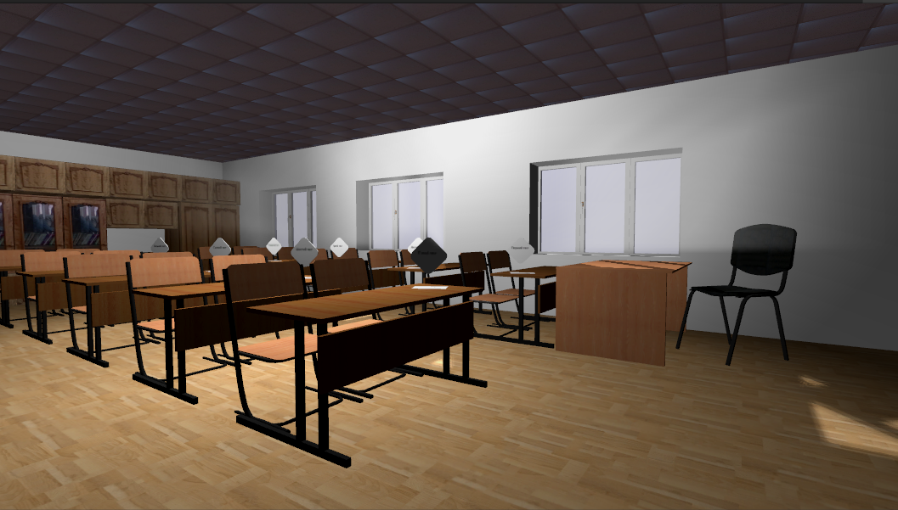
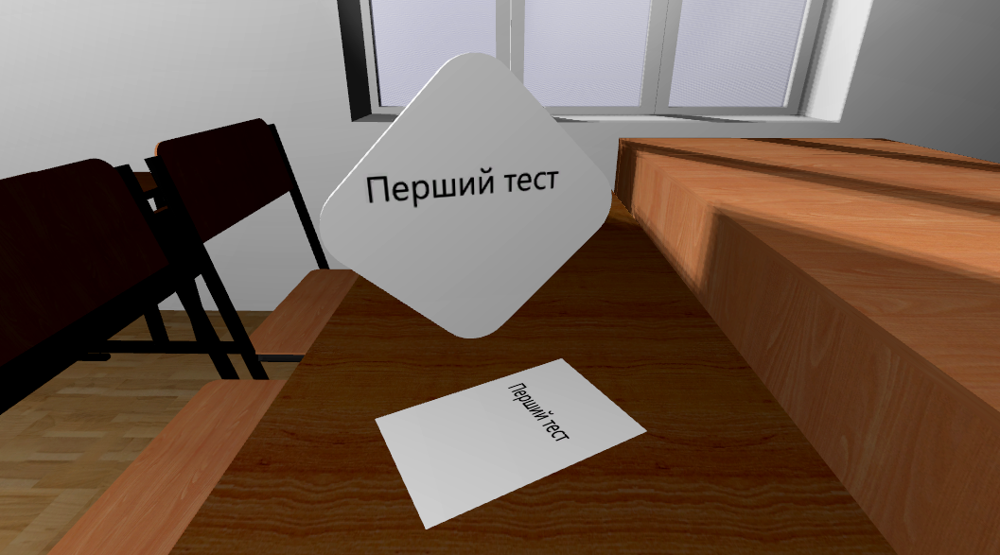
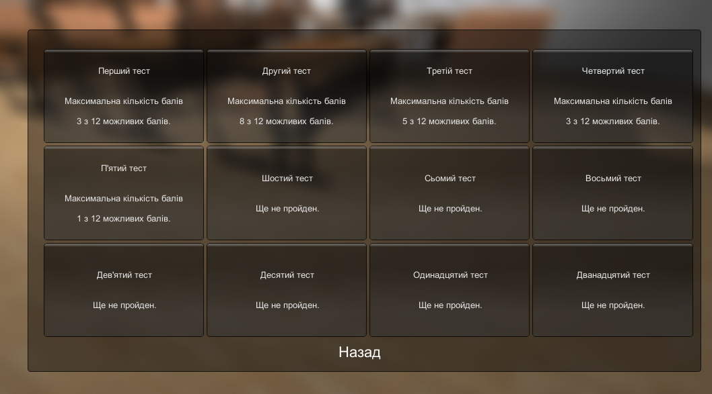
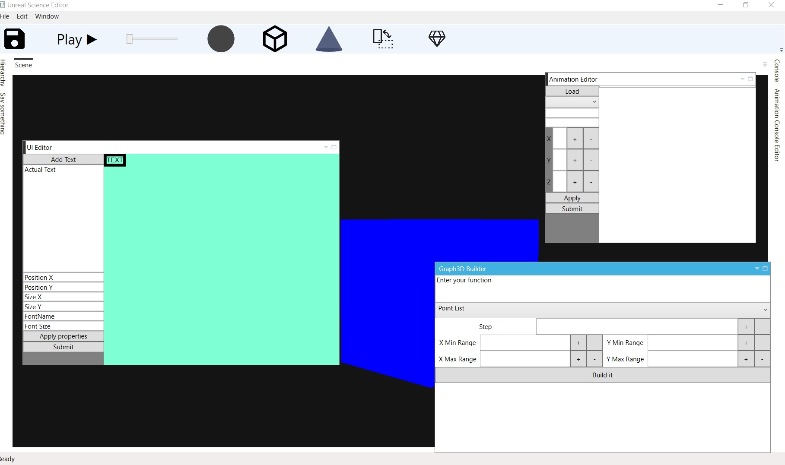
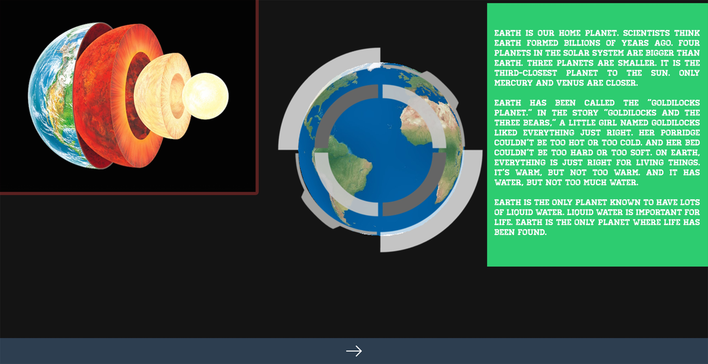

### Who am I?
I will try to be short with my intro: 
> I am a software developer who started programming at the age of 11.

Well that was shorter than I expected 😊

I started programming with Pascal at school, which was fun, my first program was inputting two numbers and gettting the sum of it. I suppose everyone has their first programming excitement and I think it is that moment that determines what you will do for the next decades. 

Well after learning Pascal, I moved to C++ as a better way to participate in competitive programming. I liked that area, but I always enjoyed the combination of programming and visual. 

I was lucky to have a course in C# at my school, that allowed me to work with Unity3D and make some awesome stuff.

The purpose of this game was to make preparation for national tests fun via games. The idea was that you enter the virtual school and each table is a separate test that you take. After you take the tests, you can view your scores. The project was simple to do (looking at the code now, I cannot imagine writing it 🙄). I presented the project at the regional competion in Ukraine and surprisingly won the third place.

I continued my exploration of Unity3D and visualization. I will write more about my other projects in another post.

After moving back to my home contry - Azerbaijan, I continued participating in competitions. I won the national competion organised by Intel at 2015 and 2016. My project [Unreal Science](https://github.com/paladium/UnrealScience) is a cross-platform system that is used to create 3D presentations for teaching. The project was unreal to make (pun intended), it was written in C++ for graphics part, C# for UI, JS for mobile part and PHP for backend. The hardest part was understanding the DirectX API (it is really not the best API out there for 3D graphics 😕), but once you figure it out you get extremely fast performance (The project was initially made in [XNA](https://en.wikipedia.org/wiki/Microsoft_XNA), that is why DirectX gave me an incredible boost). Well few screenshots from the app:

I am 21 now, I am primarily working in Golang, Vue.Js and Node.Js. In future posts, I will talk more about my other projects which helped me to get a few gold medals and 32 certificates!!.

### What is the purpose of this blog?
I am very curious about programming and everything tech-related, so I hope this blog could become a place where I can share my findings and explorations of the industry.

I am working on personal projects as well, hopefully I will post them as well.

### 

### Why put a GIF in 2020?
I enjoy pixel-art and cyber theme, so I made a small app [https://quote-me-app.herokuapp.com/api/quote](https://quote-me-app.herokuapp.com/api/quote). This app simply returns a random quote from database and a random pixel-art image from Giphy. It is written in Golang and you can find the source for it at [Github](https://github.com/Quote-Me/Quote-Me.Backend).
