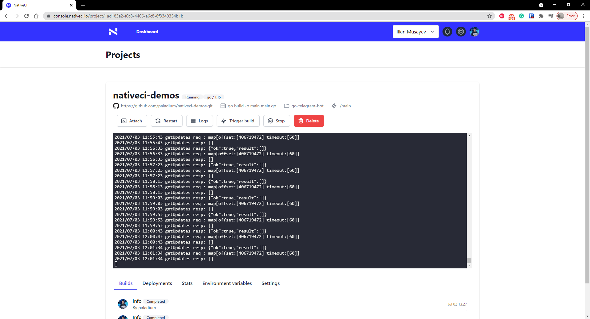

### What is NativeCI?
NativeCI is a CI/CD platform (Build and Deploy) for go applications. It supports real-time logging, app statistics and ssh access for every project.

Here is a screenshot from the deployed project:

NativeCI uses Docker to build and run images and every project gets a unique deployment url, which comes with TLS certificate.

There are no servers or configurations to manage, you just choose a repository to deploy and boom in less than 2 minutes your project is live.

### Why should I use NativeCI?
If you are a developer, you gain simplicity by focusing solely on your application and letting the platform handle the rest.

### Why another CI/CD platform?
As a developer, I like to keep my options as opened as possible, meaning I do not want to be fixed to a single vendor. For example, if I deploy using DigitalOcean App platform, I am dependend on it and it will be painful to move away. NativeCI gives you flexibility, as it is cloud-agnostic. In future, you would even be able to host it yourself and connect it to any deployment target, like VM, Kubernetes or Docker.

While making this platform, I am guided by a simple principle - is it something that I want to use in my work. So far, the answer has been yes and I am running my own workloads on the platform.

### Alpha version
Currently, the platform is in Alpha version and I am looking for any feedback and any features you would like to get implemented.

### More features coming soon
The next logical step is to support more languages for NativeCI, currently, you can run build custom Dockerfiles, meaning you can run any application. However, just like officially supporting go language and giving developers features to simplify their workflow, more languages will be added along with custom features for them.

Following that, you will be able to attach storage to your applications, for storing files that need to be persisted accross deploys.
